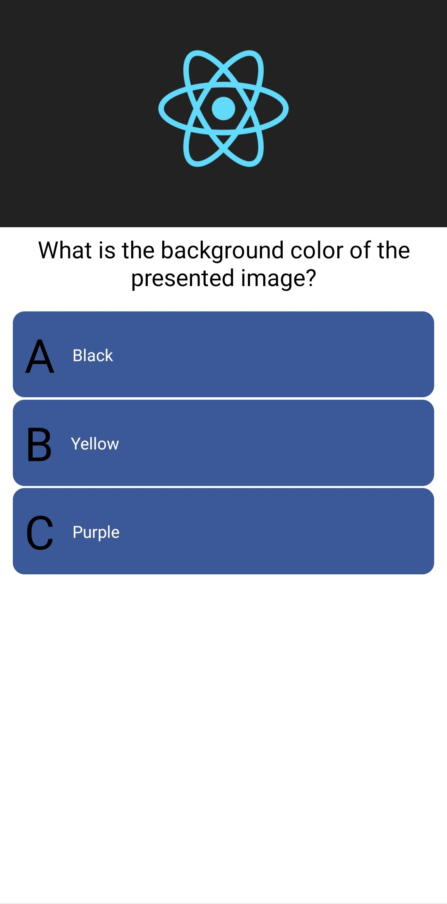
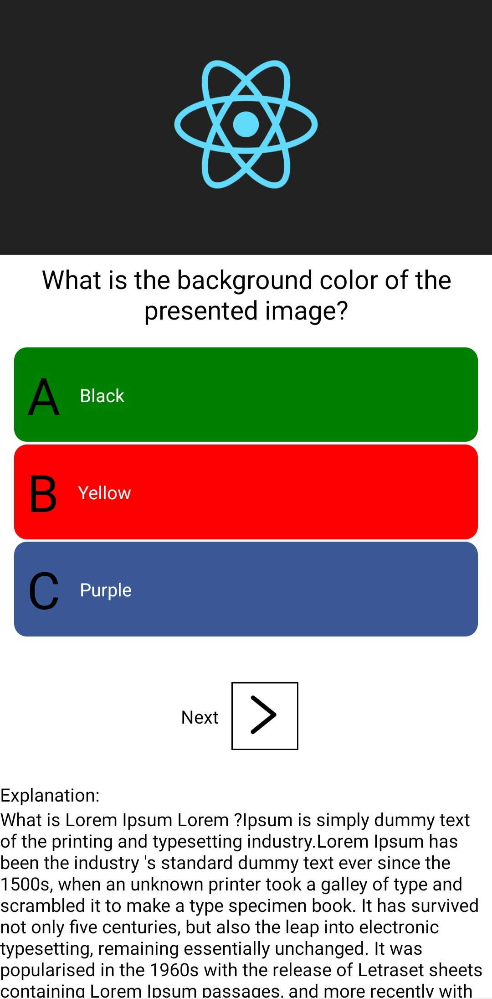
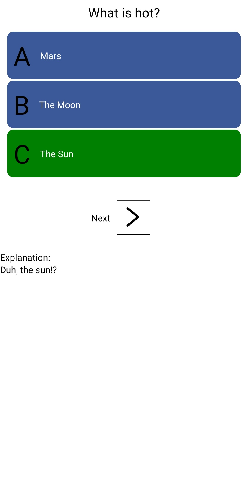

# React Native Quiz Application Using Expo

A basic quiz implementation using React Native and Expo.

## What it looks like

## Installation

    git clone https://github.com/emir-husic/react-native-quiz-app.git
    cd react-native-quiz-app
    npm install
    expo start

### Dependencies

Make sure have the following installed:

1. Expo
2. Node
